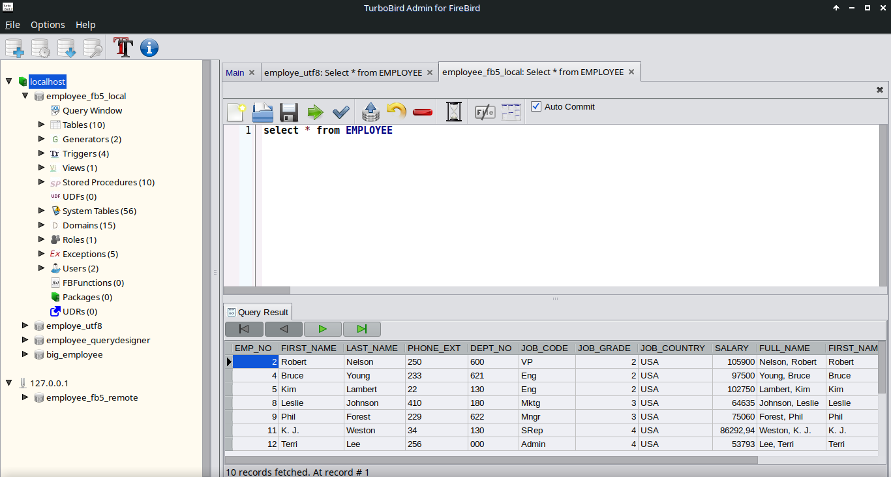
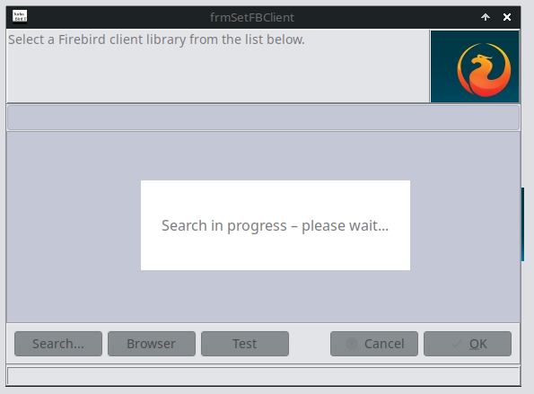
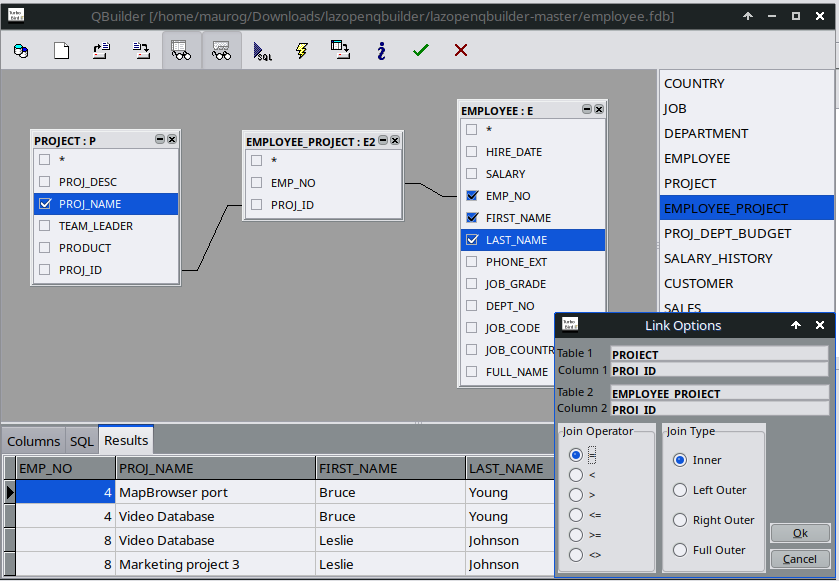
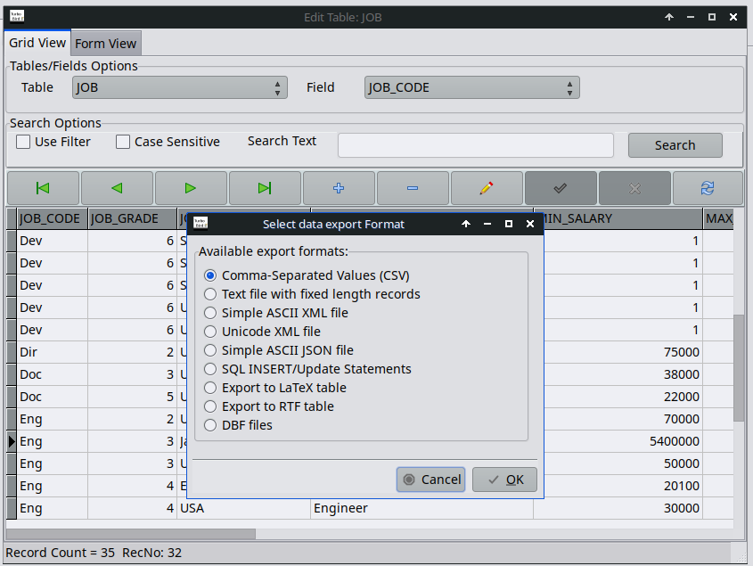
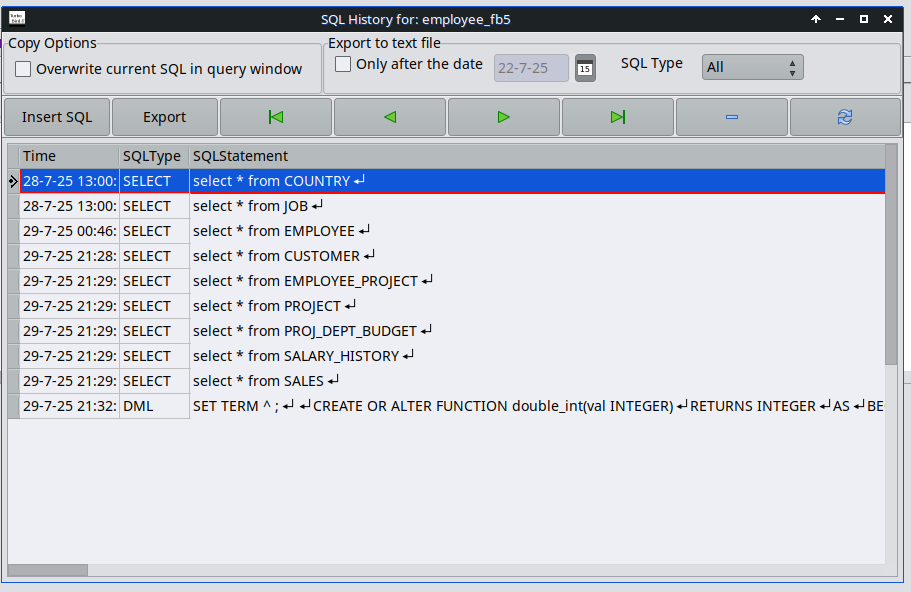
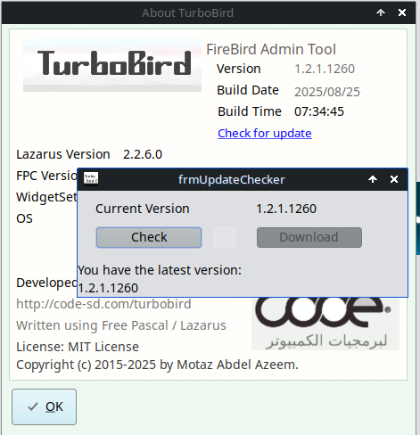
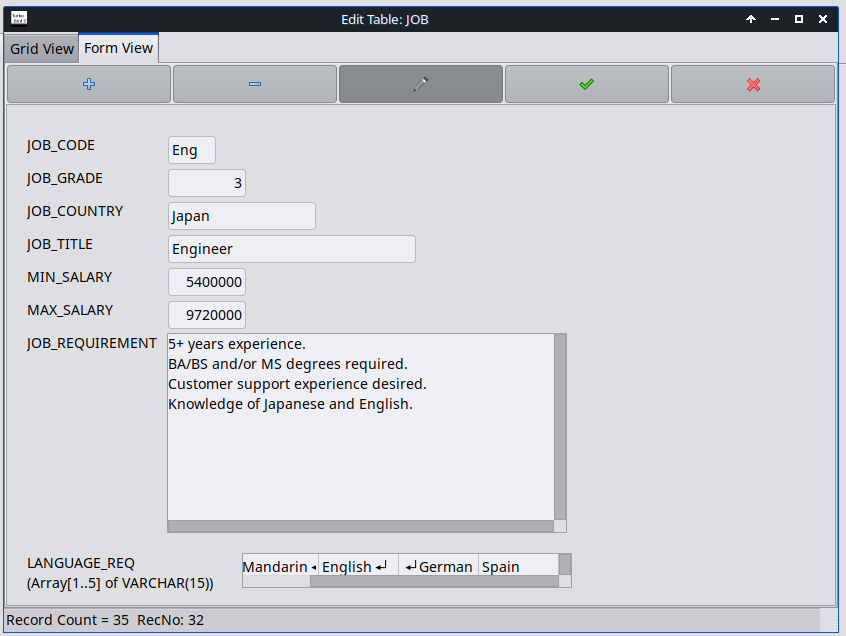

# 🐦 TurboBird – Firebird Database Tool

TurboBird is a powerful, modern administration and development tool for **Firebird databases**.  
It provides a user-friendly interface to easily view, create, edit, and manage database objects.

TurboBird - Main-Window

## 🚀 Highlights

### Database Objects
- Tables, Indexes, Foreign Keys, Primary Keys
- Domains & Exceptions
- Views (view, create, edit)
- Triggers (create, test, disable)
- User Management  

### ✅ Latest Features
- **Dynamic Firebird Data Type Handling**  
  All Firebird data types are loaded dynamically at runtime → largely version-independent.

- **Package Support**  
  Firebird packages can now be viewed, created, and edited directly in TurboBird.

- **UDR Support (User Defined Routines)**  
  Create, edit, and execute custom routines including parameters and return values.

- **Unified Routine Runner**  
  A single runner supports **UDFs, UDRs, Stored Procedures, and Functions**.

- **Firebird Client Library Selection**  
  Switch Firebird versions at any time → ideal for testing.  
  Multiple TurboBird instances with different configurations can run simultaneously.  
  This allows managing multiple Firebird servers in parallel, even with different versions.

- **Firebird Server Configuration**  
  Import, configure, and export server settings directly in TurboBird without additional tools.

- **Array and Timezone Support**  
  Full support for complex Firebird data types.
  
- **Visual Query Designer**
  Design and test queries visually

---

## ✨ Detailed Features

### Database Design
- Visually create and edit tables
- Define and optimize indexes
- Manage foreign keys and constraints
- Domains for reusable data types
- Exceptions for custom error messages

### Routines
- Create and test **Stored Procedures**
- Manage **Functions, UDFs, and UDRs**
- Unified execution interface for all routines

### Views
- Create readable **database views**
- Direct editing & testing of queries

### Triggers
- Create and edit triggers
- Enable/disable triggers for targeted testing

### User Management
- Create and manage user accounts
- Assign roles
- Configure permissions granularly

## 🎨 Screenshots

Set FireBird Clientlibrary

Visual QueryBuilder

Export Data

Query History

Checkf for Update

FireBird Array Field

