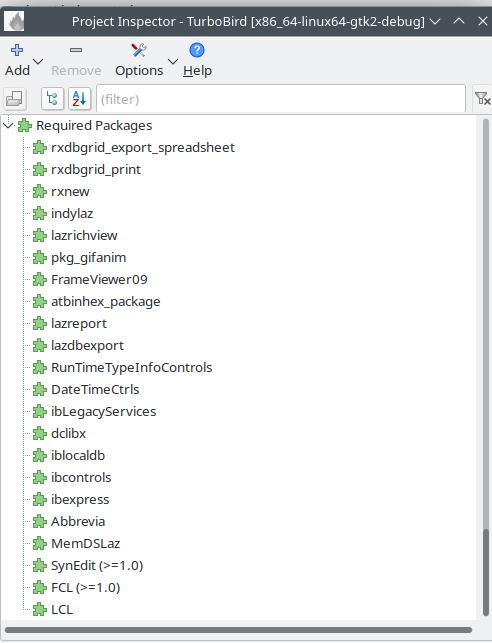

This software is dedicated to the memory of Sevinc, 
a philosopher and victim of domestic violence.
Her life ended through violence in front of her son.
Her son continues to live with the consequences to this day.

# TurboBird – Firebird Database Tool

TurboBird is a powerful, modern administration and development tool for **Firebird databases**.  
It provides a user-friendly interface to easily view, create, edit, and manage database objects.

TurboBird - Main-Window

## 🚀 Highlights

### Database Objects
The following Firebird objects can be viewed, edited, and created:
- Tables, Indexes, Foreign Keys, Primary Keys, Constraints
- Domains
- Exceptions
- Generators
- Views (view, create, edit)
- Triggers (create, test, disable)
- UDFs
- UDRs
- Stored Procedures
- Firebird Functions
- Packages
- User
- Roles

### ✅ Latest Features
- **Dynamic Firebird Data Type Handling**  
  All Firebird data types are loaded dynamically at runtime → largely version-independent.

- **Package Support**  
  Firebird packages can now be viewed, created, and edited directly in TurboBird.

- **UDR Support (User Defined Routines)**  
  Create, edit, and execute custom routines including parameters and return values.

- **Unified Routine Runner**  
  A single runner supports **UDFs, UDRs, Stored Procedures, and Functions**.

- **Firebird Client Library Selection**  
  Switch Firebird versions at any time → ideal for testing.  
  Multiple TurboBird instances with different configurations can run simultaneously.  
  This allows managing multiple Firebird servers in parallel, even with different versions.

- **Firebird Server Configuration**  
  Import, configure, and export server settings directly in TurboBird without additional tools.

- **Array and Timezone Support**  
  Full support for complex Firebird data types.
  
- **Visual Query Designer**
  Design and test queries visually

---

## ✨ Detailed Features

### Database Design
- Visually create and edit tables
- Define and optimize indexes
- Manage foreign keys and constraints
- Domains for reusable data types
- Exceptions for custom error messages

### Routines
- Create and test **Stored Procedures**
- Manage **Functions, UDFs, and UDRs**
- Unified execution interface for all routines

### Views
- Create readable **database views**
- Direct editing & testing of queries

### Triggers
- Create and edit triggers
- Enable/disable triggers for targeted testing

### User Management
- Create and manage user accounts
- Assign roles
- Configure permissions granularly

## 🎨 Screenshots

Set FireBird Clientlibrary

Visual QueryBuilder

Export Data

Query History

Checkf for Update

FireBird Array Field

Compiling

Before compiling TurboBird, the following packages must be installed in Lazarus:

After that, open Turbobird.lpi with Lazarus.

In the Lazarus main menu go to:
Project → Project Options → Config and Target

There, select the desired mode (OS / Debug) from the Build Mode combobox at the top center.

Compiling and debugging

In the Lazarus main menu go to:
Run → Compile

After that, TurboBird can be started and debugged.

Final version

Depending on the operating system, select a Release Build Mode, then go to:
Run → Build

Notes
The build process under Linux starts several scripts that rename, strip, and finally compress the generated executable file.
Renaming is important for the UpdateChecker, as the version number is added to the filename.
However, the build scripts only exist on Linux.
On MS Windows, the generated executable file must be renamed manually if the UpdateChecker is to be used.

Zum Kompilieren:

Bevor TurboBird kompiliert wird, sollten folgende Packages in Lazarus installiert sein:

Danach Turbobird.lpi mit Lazarus öffnen.

In Lazarus Hauptmenü → Project → Project Options → Config and Target
den gewünschten Modus (OS/Debug) oben in der Mitte über die Build-Mode-ComboBox auswählen.

Zum Kompilieren und Debuggen:

In Lazarus Hauptmenü → Run → Compile
Danach kann TurboBird gestartet und debuggt werden.

Für die finale Version:

Je nach Betriebssystem einen Release-Build-Mode wählen, danach
Lazarus Hauptmenü → Run → Build

Der Build-Vorgang unter Linux startet mehrere Skripte, die die generierte ausführbare Datei umbenennen, strippen und anschließend komprimieren.

Das Umbenennen ist wichtig für den UpdateChecker, da hierbei die Versionsnummer zum Dateinamen hinzugefügt wird.

Allerdings existieren die Build-Skripte nur unter Linux.
Unter MS Windows muss die erstellte EXE-Datei manuell umbenannt werden, wenn der UpdateChecker genutzt werden soll.
